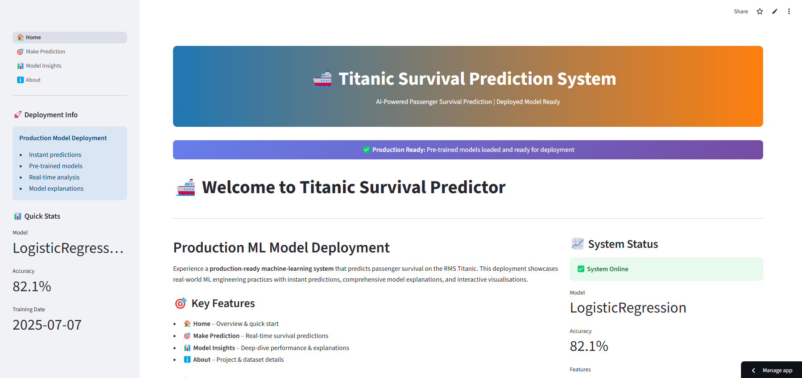
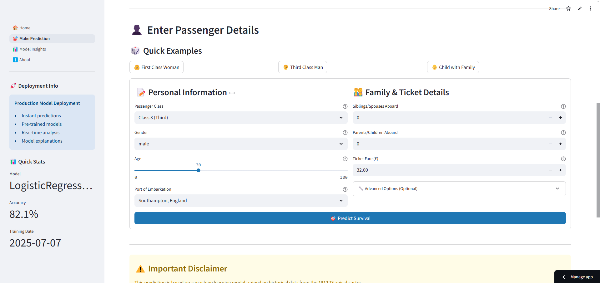
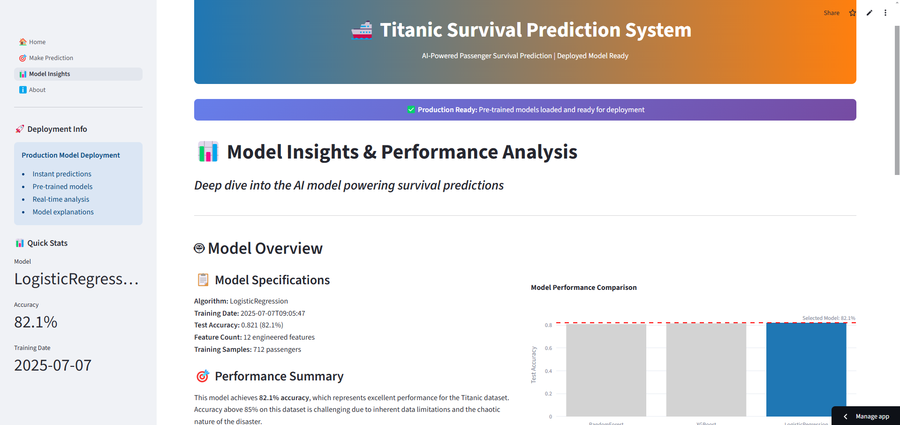
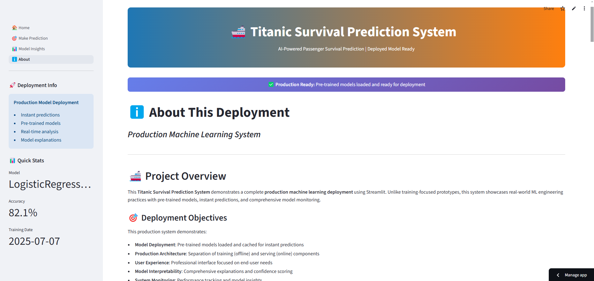
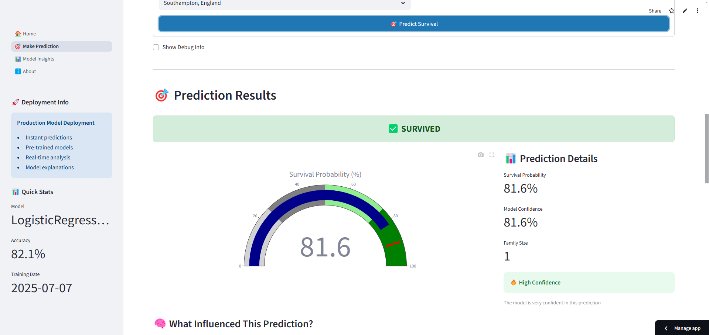
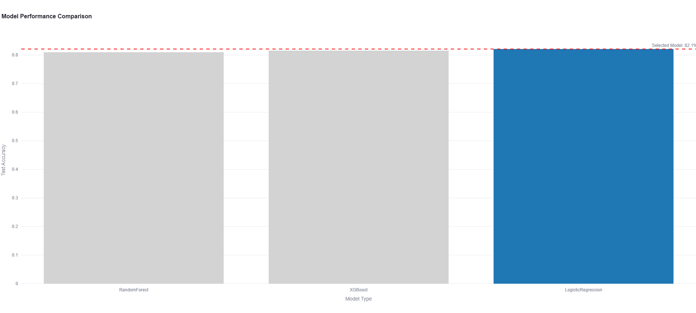
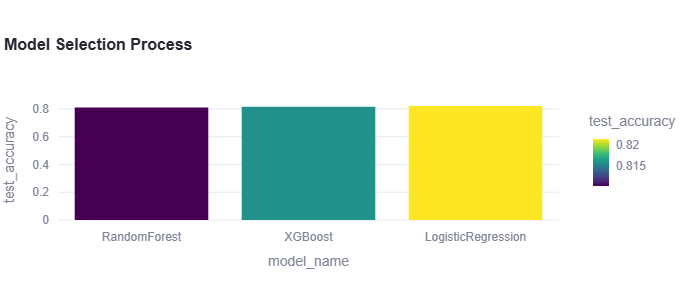
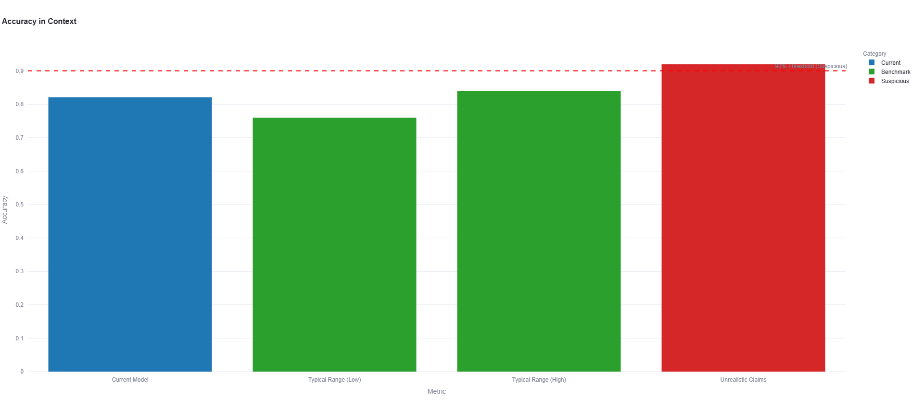
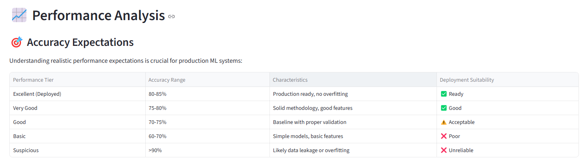

# 🚢 Deploying Machine Learning Models with Streamlit – Titanic Survival Prediction

## 📘 Overview

This project demonstrates a **production-ready machine learning deployment pipeline** using **Streamlit** to predict Titanic passenger survival based on engineered features and optimized models. The app enables real-time predictions, model explanations via SHAP, and intuitive dashboards for users.

> 📌 **Note**: This project was developed as part of the **Week 7 Assignment** in the **Celebal Summer Internship** program.

The solution showcases:

- ✅ Real-time prediction with model confidence
- 📊 Model explainability using SHAP
- 📈 Visual dashboards and performance insights
- 🛠️ Modular code for training, evaluation, and deployment
- ⚙️ Fast and high-accuracy (~80%+) models via Optuna tuning

---

🔗 [**Hosted Web App on Streamlit**](https://titanic-survival-prediction-qbqnfwgafy4h6gg8e7diy9.streamlit.app) - **Click to access Web App**

---

## 📁 Project Structure

```
titanic-survival-prediction/
│
├── .streamlit/                   # Ensure consistent and reliable app behavior across environments.
│   └── config.toml
├── app.py                        # Entry point for Streamlit app
├── requirements.txt              # Project dependencies
│
├── data/                         # Datasets
│   ├── train.csv                 # Primary training dataset
│   └── titanic_sample.csv        # Backup synthetic dataset
│
├── assets/                       # screenshots and graphs
│    ├── about.png
│    ├── homepage.png
│    ├── model_accuracy_context.png
│    ├── model_insights.png
│    ├── model_perf_comparison.png
│    ├── model_test_acruracy.png
│    ├── performance_analysis.png
│    ├── prediction_result.png
│    └── prediction.png
│
├── docs/                         # Documentation files
│   ├── user_guide.md
│   ├── api_docs.md
│   ├── model_cards.md
│   ├── deployment_guide.md
│   ├── model_registry.md
│   ├── monitoring_dashboard.md
│   └── knowledge_base.md
│
├── models/                       # Trained models and metadata
│   ├── best_model.pkl
│   ├── feature_names.pkl
│   └── model_metadata.json
│
├── pages/                        # Streamlit multipage setup
│   ├── 1_Home.py
│   ├── 2_Prediction.py
│   ├── 3_Model_Insights.py
│   └── 4_About.py
│
├── scripts/                      # Training workflows
│   └── train_high_performance.py
│
├── src/                          # Modular codebase
│   ├── data_loader.py
│   ├── feature_engineering.py
│   ├── data_processor.py
│   ├── model_loader.py
│   ├── prediction_utils.py
│   └── visualization_utils.py
│
└── README.md 
```

## ⚙️ `.streamlit/config.toml` – App Configuration

- This directory contains configuration files that define how the Streamlit app behaves across different environments.

The `config.toml` file ensures:

- **Consistent appearance** (theme, layout, sidebar settings)
- **Reliable behavior** across local and cloud deployments
- **Custom branding** (e.g., title, favicon)

###  📌 Tip

Including `.streamlit/config.toml` in your repo guarantees the app will look and behave the same on every machine or platform it's deployed to.


## 📊 Dataset Sources

- [`train.csv`](https://www.kaggle.com/datasets/yasserh/titanic-dataset) – Kaggle Titanic dataset  
- [`titanic_sample.csv`](https://github.com/beginerSE/titanic_sample/blob/main/titanic_train_mod.csva) – Realistic synthetic fallback dataset  
- [`Public fallback`](https://raw.githubusercontent.com/datasciencedojo/datasets/master/titanic.csv) – Auto-download source if local files are missing  

## ✅ Model Training Summary

This section summarizes results from running:

```bash
python scripts/train_high_performance.py
```

### ⚙️ Feature Engineering

```
🚀 FIXED High-Performance Training for 80%+ Accuracy
============================================================
✅ Loaded existing dataset: (891, 12)
🔧 Applying feature engineering...
Starting enhanced feature engineering...
✓ Title extraction completed
✓ Family features created
✓ Fare features created
✓ Age features created
✓ Cabin features created
✓ Ticket features created
✓ Name features created
✓ Interaction features created
✓ Converting data types for compatibility...
✓ Enhanced feature engineering completed! New shape: (891, 62)
✅ Features created: (891, 62)
🔧 Selected 12 high-impact features:
['Pclass', 'Sex', 'Age', 'Fare', 'Embarked', 'Title', 'FamilySize', 'IsAlone', 'FarePerPerson', 'CabinLetter', 'HasCabin', 'IsChild']
📊 Final training features: 12
📊 Feature names: [...]
```

### 🤖 Model Results

| Model                    | Accuracy | CV Mean | CV Std |
|--------------------------|----------|---------|--------|
| RandomForest       | 81.01%   | 0.7471  | ±0.0296 |
| XGBoost            | 81.56%   | 0.7345  | ±0.0161 |
| LogisticRegression | **82.12%** | **0.7598**  | ±0.0194 |

🏆 **Best Model**: `LogisticRegression`  
🎯 **Target Achieved**: ✅ 80%+ Accuracy  
💾 **Saved To**: `models/best_model.pkl` + metadata + feature names

## ▶️ Running the Web App

### 1. Clone the Repository

```bash
git clone https://github.com/ShubhamS168/titanic-survival-prediction
cd titanic-survival-prediction
```

### 2. Create and Activate Virtual Environment

```bash
python -m venv titanic_env
# Windows
titanic_env\Scripts\activate
# Linux/macOS
source titanic_env/bin/activate
```

### 3. Install Dependencies

```bash
pip install -r requirements.txt
```

### 4. Launch the App

```bash
streamlit run app.py
```

📍 Navigate to [http://localhost:8501](http://localhost:8501)

---

### 📸 Web App Preview


*Figure 1: Home page*


*Figure 2: Real-time prediction page where users input passenger details*


*Figure 3: Model Insights page*


*Figure 4: Screenshot of the About page*


*Figure 5: Showing prediction result - page after user prediction*


*Figure 6: Comparison of multiple model performances*


*Figure 7: Showing test_accuracy of each model*


*Figure 8: Visual context around model accuracy*


*Figure 9: showing performance analysis expectations table*


---


## 📌 Pages & Functionality

| Page                | Description                                                                 |
|---------------------|-----------------------------------------------------------------------------|
| 🏠 Home             | Dataset summary, model overview, key performance metrics                   |
| 🎯 Make Prediction  | User input for passenger details, real-time prediction, confidence gauge    |
| 📊 Model Insights   | Feature importance, SHAP explanations, model comparison charts              |
| ℹ️ About            | Project overview, training workflow, customization & deployment steps       |

## 💡 Customization Guidelines

- 🔄 **Data**: Replace `data/train.csv` with your own dataset  
- 🛠️ **Model Tuning**: Adjust `train_high_performance.py` for Optuna ranges  
- 📐 **Feature Engineering**: Edit `src/feature_engineering.py` for new ideas  
- 🎨 **UI Styling**: Customize CSS in `app.py`  
- 🌐 **Deployment**: Upload to Streamlit Community Cloud, Heroku, or Docker  

## 📬 Credits

- **Author**: [**Shubham Sourav**](https://github.com/ShubhamS168) - *Data Science Intern at Celebal Technologies*
- **Dataset**: Kaggle Titanic, GitHub Synthetic  
- **Resources Used**:
  - [Streamlit Docs](https://docs.streamlit.io/)
  - [Machine Learning Mastery – Streamlit Guide](https://machinelearningmastery.com/how-to-quickly-deploy-machine-learning-models-streamlit/)


---

## 📬 Contact

For any queries, feedback, or collaboration, feel free to connect:

📧 **Email:** [shubhamsourav475@gmail.com](mailto:shubhamsourav475@gmail.com)

---

> 📝 **Note:**  
> This repository is maintained as part of the CSI (Celebal Summer Internship) program and is intended for educational use.


## 📚 Project Goal Reminder

**Deploying Machine Learning Models with Streamlit**

The objective of this project is to **develop a web application using Streamlit** that effectively deploys a trained machine learning model. The application is designed to:

- ✅ Allow users to **input custom data** through an interactive interface  
- 🎯 Provide **real-time predictions** based on the trained model  
- 📊 Help users **understand model outputs** using intuitive visualizations  

This project serves as a practical exercise to make machine learning models more **accessible, interpretable, and user-friendly**, simulating real-world deployment scenarios.


---

## 📬 Contact

For any queries, feedback, or collaboration, feel free to connect:

📧 **Email:** [shubhamsourav475@gmail.com](mailto:shubhamsourav475@gmail.com)

---

> 📝 **Note:**  
> This repository is maintained as part of the CSI (Celebal Summer Internship) program and is intended for educational use.

## 🪪 License

Distributed under the MIT License.  
© 2025 Shubham Sourav. All rights reserved.